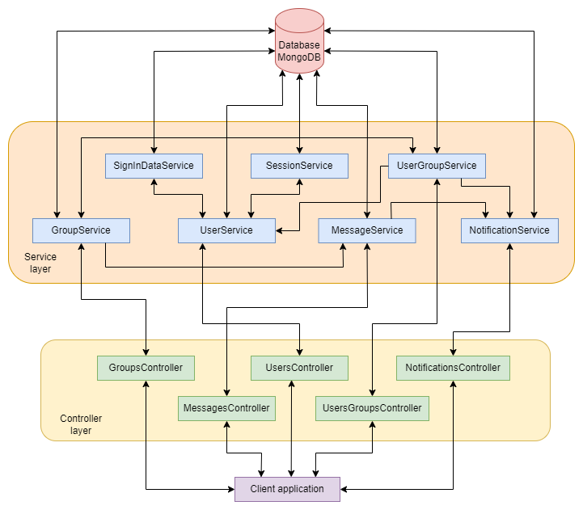

## Stellar - backend

Backend for Stellar, an android application / social network for students and study groups.

Copyright &copy; 2023. All rights reserved.

### Team members:

- Ján Ágh
- Irina Makarova

### Technology:

- Python
- Django & Django REST Framework
- MongoDB Atlas

### System architecture:

Below can be seen the structural architecture of the system together with details regarding information flow & processing.

### Safety functionalities:

- Incorporates password hashing & session token generation
- Every request to protected routes requires authentification with token
- Session tokens can expire after some period of inactivity
- Automatic regeneration of expired tokens if users can provide the previous one